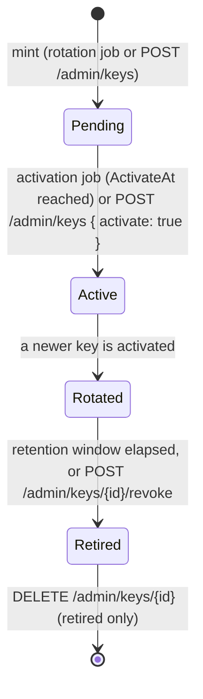

# Key management

Each tenant signs with its **own rotated RSA key**. Keys live in the `HuiaSigningKeys` table (status
enum stored as a string) with private material wrapped by ASP.NET Core Data Protection.
`HuiaSigningKey` is deliberately **not** a multi-tenant entity — it carries a manual `TenantId` so
the lifecycle jobs can run with no tenant scope.

## Lifecycle

- **Pending** — published in the JWKS (so RPs can pre-fetch it) but does not sign.
- **Active** — the one key that signs; activating a new key demotes the current active to *Rotated*.
- **Rotated** — still validates (tokens signed before the switch are still in flight) but no longer
  signs.
- **Retired** — stops signing **and** validating at once. `revoke` is refused with `409` if it would
  leave the tenant with no active key.

## Serving

`IHuiaKeyRing` is a `HybridCache`-backed service (not an entity). RSA import is memoised by `kid` in
a process-static dictionary. It exposes the active signing key and the published (validation) set per
tenant. The custom OpenIddict handlers (see [Request & token flow](/architecture/request-flow)) use
the active key for signing and the whole published set for validation; `HuiaTenantJwksHandler` serves
the published set at `/{tenant}/.well-known/jwks`.

## Jobs

Four Quartz jobs — promote pending → active, rotate on schedule, retire rotated keys past the
overlap window, delete retired keys — gated by `KeyManagementOptions.EnableBackgroundJobs` (default
true). Tests and the `Huia:EnableBackgroundJobs=false` sample flag disable them: Quartz keeps a
process-static log provider that throws on a second host in the same process.
