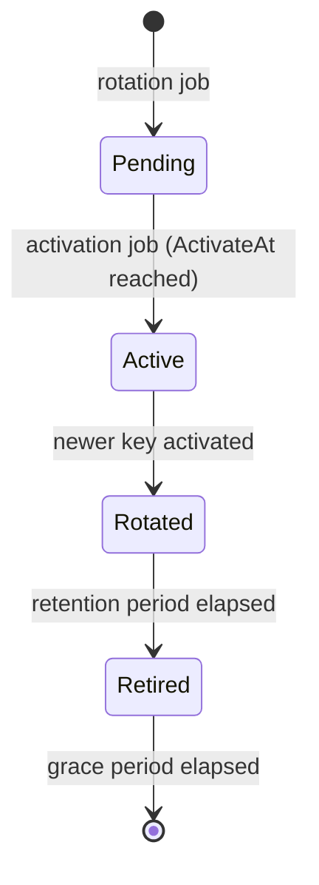

# Key management

Each tenant has its own RSA signing keys in `HuiaSigningKeys`. Private material is wrapped with
ASP.NET Core Data Protection.

`IHuiaKeyRing` serves the published keys through `HybridCache`; the custom OpenIddict handlers
inject the active key for signing and the whole published set for validation.
