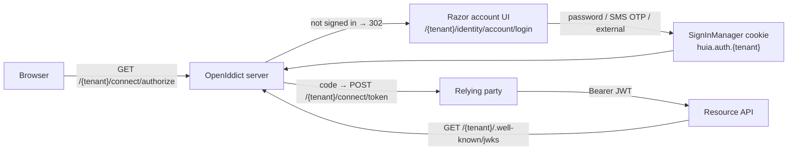

# Architecture overview

Huia turns one ASP.NET Core host + one database into an OIDC provider that serves **many isolated
tenants**. A tenant is a URL base-path segment, an EF Core row-scope, a signing-key set, an issuer
(`{Issuer}/{tenant}`), and a bundle of per-tenant Identity + sign-in policy.



## Packages

Huia ships two independent authentication flavors over a shared core, so a host picks the one that
fits and links only that flavor's packages:

| Package | Role |
|---|---|
| `Huia` | domain model, the options tree, eventing, constants, the `IHuiaTenantContext` seam, generic `HuiaUserManager<TUser>`/`HuiaSignInManager<TUser>` — **no** EF Core / OpenIddict / Finbuckle dependency (a build target enforces it), though the ASP.NET Core shared framework is allowed |
| `Huia.EntityFrameworkCore` | common, tenant-agnostic EF Core schema (`ConfigureHuiaIdentitySchema<TUser,TRole>()`) and `AddEntityFrameworkCoreStores<TContext,TUser,TRole>()`, shared by both flavors below |
| `Huia.OpenId.EntityFrameworkCore` | `HuiaDbContext : MultiTenantIdentityDbContext`, layers OpenIddict + tenant-scoped composite indexes on top of the common schema — ships no migrations |
| `Huia.OpenId` | `AddHuiaOpenId()` / `UseHuiaOpenId()` / `MapHuiaEndpoints()` — multi-tenant, OpenIddict server + client, the Razor account UI, passwordless SMS, key-lifecycle jobs, security headers |
| `Huia.Headless.EntityFrameworkCore` | `HuiaDbContext : IdentityDbContext<HuiaUser,HuiaRole,string>` — single-tenant, no multi-tenant schema additions |
| `Huia.Headless` | `AddHuiaHeadless(...)` / `MapHuiaHeadlessEndpoints()` — a flat, tenant-free, branding-free options builder (single-tenant internally, but that's never exposed), ASP.NET Core Identity bearer tokens via `MapIdentityApi`, no OpenIddict, no Finbuckle. See the [Shop sample](https://github.com/Ayman-Elfaki/Huia/tree/main/samples/Shop.Api) |

A host wires one flavor via a single root call:

```csharp
services.AddHuiaOpenId(huia => { /* options */ })       // or .AddHuiaHeadless(huia => { /* options */ })
    .AddEntityFrameworkCoreStores<HuiaDbContext>();      // Huia.EntityFrameworkCore
```

## Pipeline order

`UseHuiaOpenId()` (the `Huia.OpenId` flavor only — `Huia.Headless` has no hosted UI or per-tenant
routing, so it needs no equivalent) fixes the middleware order:

```
UseExceptionHandler → UseStatusCodePagesWithReExecute → UseRequestLocalization
  → UseMultiTenant   (before UseRouting — the base-path strategy rebases PathBase to /{tenant})
  → HuiaSecurityHeadersMiddleware   (opt-in; after UseMultiTenant so the CSP can use tenant branding)
  → UseStaticFiles → UseRouting → UseAuthentication → UseAuthorization
```

## Tenant isolation

`HuiaDbContext` derives from Finbuckle's `MultiTenantIdentityDbContext<HuiaUser, HuiaRole, string>`:

- a **global query filter** `TenantId == TenantInfo.Id` scopes every read of a user / role / claim /
  login / token entity;
- `SaveChanges` runs `EnforceMultiTenant()` — throws on a tenant-less or cross-tenant write,
  auto-stamps `TenantId` on insert;
- `TenantInfo` is snapshotted **at context construction**, so seeding / background code must set the
  ambient tenant (`HuiaTenantScope.Enter(...)`) before resolving the context or `UserManager`.

See [`src/dotnet/SPEC.md`](https://github.com/Ayman-Elfaki/Huia/blob/main/src/dotnet/SPEC.md) for the
full specification and [Multi-tenancy](/guide/multi-tenancy) for the request-time details.
