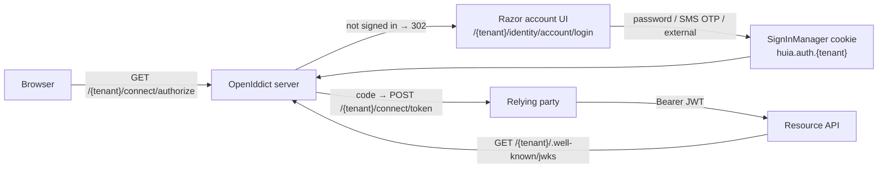

# Architecture overview

Huia turns one ASP.NET Core host + one database into an OIDC provider that serves **many isolated
tenants**. A tenant is a URL base-path segment, an EF Core row-scope, a signing-key set, an issuer
(`{Issuer}/{tenant}`), and a bundle of per-tenant Identity + sign-in policy.



## Packages

| Package | Role |
|---|---|
| `Huia` | domain model, the options tree, eventing, constants — **no** ASP.NET Core / EF Core dependency (a build target enforces it) |
| `Huia.EntityFrameworkCore` | `HuiaDbContext : MultiTenantIdentityDbContext`, `Huia*` table renames, tenant-scoped composite indexes — ships no migrations |
| `Huia.AspNetCore` | `AddHuia()` / `UseHuia()` / `MapHuiaEndpoints()`, OpenIddict server + client, the Razor account UI, passwordless SMS, key-lifecycle jobs, security headers |

## Pipeline order

`UseHuia()` fixes the middleware order:

```
UseExceptionHandler → UseStatusCodePagesWithReExecute → UseRequestLocalization
  → UseMultiTenant   (before UseRouting — the base-path strategy rebases PathBase to /{tenant})
  → HuiaSecurityHeadersMiddleware   (opt-in; after UseMultiTenant so the CSP can use tenant branding)
  → UseStaticFiles → UseRouting → UseAuthentication → UseAuthorization
```

## Tenant isolation

`HuiaDbContext` derives from Finbuckle's `MultiTenantIdentityDbContext<HuiaUser, HuiaRole, string>`:

- a **global query filter** `TenantId == TenantInfo.Id` scopes every read of a user / role / claim /
  login / token entity;
- `SaveChanges` runs `EnforceMultiTenant()` — throws on a tenant-less or cross-tenant write,
  auto-stamps `TenantId` on insert;
- `TenantInfo` is snapshotted **at context construction**, so seeding / background code must set the
  ambient tenant (`HuiaTenantScope.Enter(...)`) before resolving the context or `UserManager`.

See [`src/dotnet/SPEC.md`](https://github.com/Ayman-Elfaki/Huia/blob/main/src/dotnet/SPEC.md) for the
full specification and [Multi-tenancy](/guide/multi-tenancy) for the request-time details.
