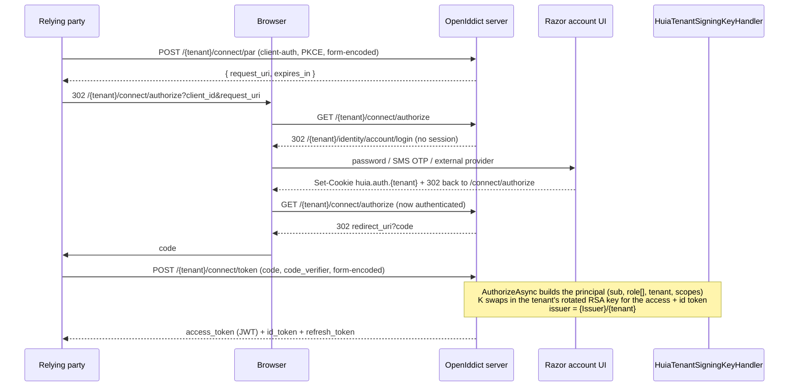

# Request & token flow

## Interactive sign-in (Authorization Code + PKCE, with PAR)

## Token validation

Tokens are minted with the tenant's rotated key and per-tenant issuer, so three custom OpenIddict
handlers are inserted at fixed orders:

| Handler | Event | Order | Job |
|---|---|---|---|
| `HuiaTenantSigningKeyHandler` | `GenerateTokenContext` | `int.MinValue + 100_500` | override `SigningCredentials` for the **access token / id token only** (overriding the code or refresh token breaks `code` exchange) |
| `HuiaTenantTokenValidationHandler` | `ValidateTokenContext` | `int.MinValue + 101_000` | append the tenant's published keys to `IssuerSigningKeys` and `{Issuer}/{tenant}` to `ValidIssuers` |
| `HuiaTenantJwksHandler` | JWKS request | `int.MaxValue - 100_000` | serve the tenant's published keys at `/{tenant}/.well-known/jwks` |

A resource API on a **separate host** simply points its JWT bearer validation at
`{Issuer}/{tenant}/.well-known/openid-configuration` and gets the right keys over HTTP.

## Passwordless SMS

`amr=sms` is a cookie sign-in the account UI performs after verifying a one-time code; `/connect/authorize`
accepts it with zero OpenIddict changes. The full flow is in [Passwordless SMS](/dotnet/passwordless-sms).

## Relying party (Nuxt)

`huia-auth-nuxt` runs the RP half of the diagram on the Nitro server and keeps every token
server-side — see [the Nuxt module docs](/nuxt/overview).
