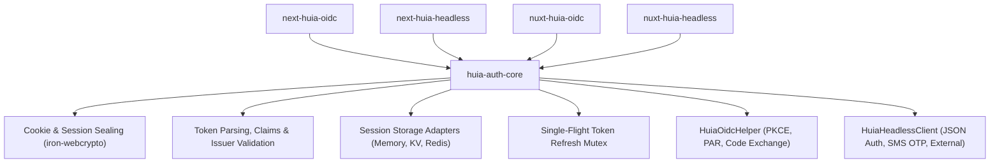

# `huia-auth-core` — Shared Authentication Core

`huia-auth-core` is the platform-agnostic TypeScript foundation shared across **Next.js** (`next-huia-oidc`, `next-huia-headless`) and **Nuxt** (`nuxt-huia-oidc`, `nuxt-huia-headless`). It provides cryptographic session management, token storage abstractions, token lifecycle handling, OpenID Connect client coordination, and headless client operations without ties to any particular web framework.

- Package: `huia-auth-core`
- Built on [`iron-webcrypto`](https://github.com/bruno-garcia/iron-webcrypto) and [`openid-client`](https://github.com/panva/openid-client) v6
- Compatible with Node.js 20+, Cloudflare Workers, Edge Runtime, Vercel, and modern browser environments

## Core Responsibilities

## Module Exports

### 1. Cookie & Session Sealing (`cookie.ts`)
- `sealSession(payload, password)`: Seals JSON payloads with AES-256-GCM using `iron-webcrypto`.
- `unsealSession(sealed, password)`: Decrypts and validates sealed cookies.
- `chunkCookie(name, value, maxSize)`: Chunks cookies exceeding browser limits (~4 KB) into `name.0`, `name.1`, etc.
- `assembleCookieChunks(cookieHeader, baseName)`: Reassembles chunked cookies into the complete encrypted payload.

### 2. Token Helpers (`tokens.ts`)
- `pickUserClaims(payload, allowedClaims)`: Sanitizes identity tokens and claims objects so sensitive fields never reach the client.
- `isTokenExpired(expiresAt, earlyRefreshSeconds)`: Calculates whether an access token needs proactive refreshing.
- `assertIssuerMatches(actual, expected)`: Ensures IdP issuer responses match the configured issuer endpoint.

### 3. Session Storage Adapter (`storage.ts`)
- `HuiaStorageAdapter`: Interface defining `getTokenRecord`, `setTokenRecord`, `deleteTokenRecord`.
- `MemoryStorageAdapter`: Built-in in-memory storage implementation for local development and unit tests. Easily swapped with Redis, DynamoDB, or Upstash in production.

### 4. Concurrency & Refresh Mutex (`refresh.ts`)
- `TokenRefreshMutex`: Deduplicates simultaneous refresh requests within a single process. Multiple parallel incoming API calls await a single refresh round-trip, preventing token grant race conditions.

### 5. OpenID Connect Helper (`oidc-client.ts`)
- `HuiaOidcHelper`: Encapsulates `openid-client` v6 discovery, Pushed Authorization Requests (RFC 9126 PAR), code exchange, client authentication, and RP-initiated logout URLs.

### 6. Headless Client (`headless-client.ts`)
- `HuiaHeadlessClient`: Pure JSON API client for `Huia.Headless` ASP.NET Core backends, covering email/password login, registration, phone SMS one-time passcode flows, and external identity broker flows.
