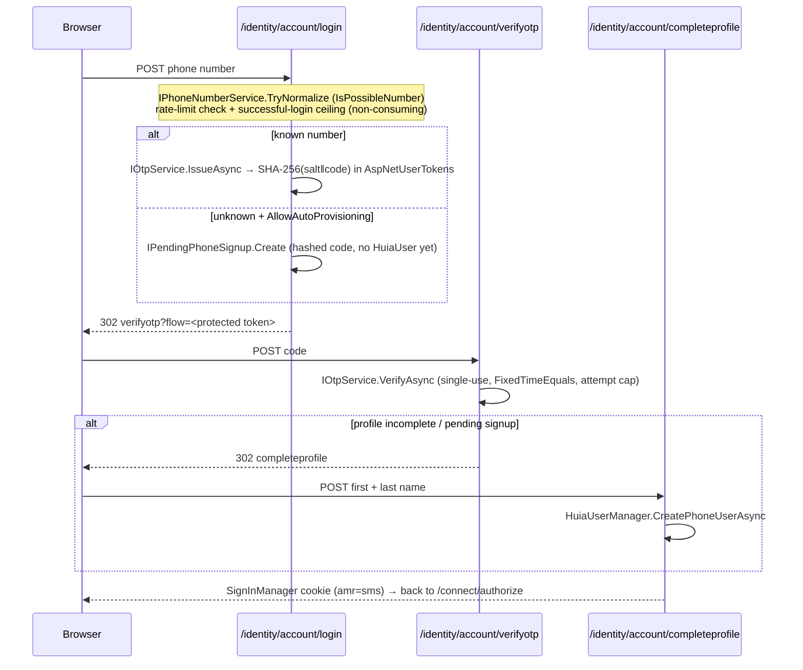

# Passwordless SMS

A tenant enables SMS one-time-code sign-in with `UsePasswordlessFlow(pwl => pwl.UsePhoneLogin(…))`.
The account UI then shows a **Phone** tab (alongside **Email** when the password flow is also on) that
collects a number, dispatches a code, and hands off to a verification page.

## Configuration

```csharp
tenant.Authentication.UsePasswordlessFlow(pwl => pwl.UsePhoneLogin(phone =>
{
    phone.DefaultCountry = "SA";                  // interpret national numbers; format-checked only
    phone.AllowAutoProvisioning = true;           // unknown well-formed number may start a sign-up
    phone.CodeLength = 6;                         // 4–10
    phone.CodeLifetime = TimeSpan.FromMinutes(5);
    phone.MaxVerificationAttempts = 5;            // per issued code
    phone.PendingSignupLifetime = TimeSpan.FromMinutes(30);  // >= CodeLifetime
    phone.ResendCooldown = TimeSpan.FromSeconds(30);
    phone.Captcha = CaptchaMode.None;
    phone.SuccessfulLoginsPerWindow = 1;          // successful-sign-in ceiling per number
    phone.SuccessfulLoginWindow = TimeSpan.FromMinutes(2);
    phone.SuccessfulLoginsPerDay = 5;
}));
```

An SMS provider is configured under `Huia:Sms` (root) and optionally per tenant (`tenant.Sms`);
`SmsOptions.MergedWith` folds them — `LogCodesToLogger` is OR-merged and cannot be turned off by a
tenant, and `RateLimit` is kept from the tenant **only** if the tenant also set its own `Provider`.

## Flow



Key points:

- The account is **never created at code-request time** — a `IPendingPhoneSignup` record holds the
  hashed code until `CompleteProfile` calls `HuiaUserManager.CreatePhoneUserAsync`, so a blank-name
  user is never persisted.
- A phone account's `UserName` **is** its E.164 number; `HuiaUserManager.FindByPhoneNumberAsync`
  queries the `PhoneNumber` column, and confirming a phone change calls `SetUserNameAsync` to keep
  them in lock-step.
- The one-time code is `RandomNumberGenerator.GetInt32`, stored as `SHA-256(salt ‖ code)` in
  `AspNetUserTokens` (provider `Huia.Passwordless`, name `otp`) — **no EF migration**, that table
  already exists. Verification is single-use, constant-time, attempt-capped, `TimeProvider`-based for
  expiry.
- Unknown number with `AllowAutoProvisioning` **off** behaves identically to a known number (same
  redirect, same timing) to avoid enumeration.
- The successful-sign-in ceiling is checked with a non-consuming `CanRecordLogin` **before** an SMS is
  spent; the permit is consumed by `TryRecordLogin` only on a completed sign-in.

## Testing

`Huia:EnableE2E` on the sample host adds an `e2e` tenant, a `CapturingSmsSender`, and a
`GET /e2e-otp?phone=` endpoint that hands the last code back so E2E specs can complete the flow.
`Huia.IntegrationTests` covers issue / verify / expiry / attempt-cap and both rate limiters.
