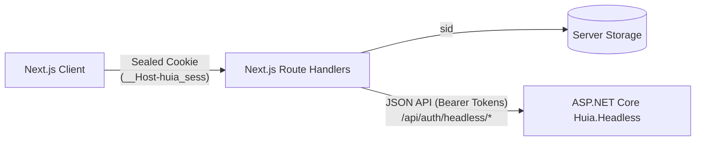

# `next-huia-headless` — Overview

`next-huia-headless` is the official **Next.js 14 / 15** client library for interacting with `Huia.Headless` ASP.NET Core backends. Designed for applications that own their user interfaces completely, it provides password login, self-registration, phone SMS one-time passcode verification, and external broker flows over pure JSON APIs without OIDC redirects or hosted identity forms.

- Package: `next-huia-headless`
- Built on [`huia-auth-core`](/core/overview)
- Compatible with Next.js App Router (14+, 15+)

## Key Features

- **No hosted login screens**: Your Next.js app renders all registration, password, SMS OTP, and profile forms.
- **Sealed cookie layer**: Transparently handles tokens behind the scenes. Route Handlers convert JSON token responses into sealed `__Host-huia_sess` cookies via `iron-webcrypto`.
- **Phone SMS one-time passcodes**: Complete three-stage flow: start with phone number, verify code, and complete optional profile (first/last name).
- **External identity providers**: Initiate external broker redirects and complete user profile callbacks.
- **App Router support**: Server session reading via `getHuiaHeadlessSession()` and client state via `HuiaHeadlessProvider`, `useHuia()`, and `useUserSession()`.

## Architecture

