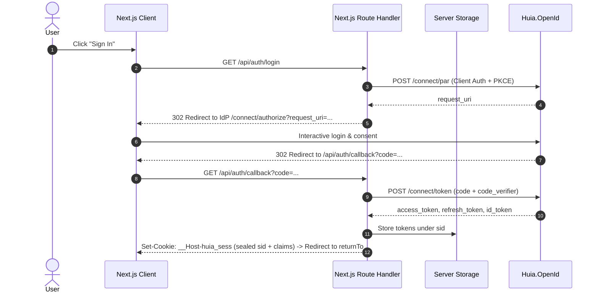

# `next-huia-oidc` — Overview

`next-huia-oidc` is the official **Next.js 14 / 15** integration library for signing a relying-party application into a `Huia.OpenId` tenant. It executes the OAuth 2.0 Authorization Code Flow with PKCE and Pushed Authorization Requests (RFC 9126 PAR) on the **Next.js Route Handlers / Server Components**, keeping tokens secure on the server.

- Package: `next-huia-oidc`
- Compatible with Next.js App Router (14+, 15+)
- Core engine: [`huia-auth-core`](/core/overview) and [`openid-client`](https://github.com/panva/openid-client) v6

## Key Features

- **Dual-layer session security**: The browser only receives an encrypted, chunked `__Host-huia_sess` cookie (`iron-webcrypto`) containing an opaque session identifier and safe claims. Raw access, refresh, and ID tokens are stored in server-side storage.
- **Pushed Authorization Requests (PAR)**: Authorization parameters are securely pushed via backchannel to Huia's `/{tenant}/connect/par` endpoint, exposing only a transient `request_uri` in the browser.
- **Transparent token refresh**: Server-side helpers automatically refresh access tokens when nearing expiration using a single-flight mutex.
- **Full App Router support**: Works across React Server Components, Server Actions, Route Handlers, and Client Components with `<HuiaOidcProvider>` and `useUserSession()`.
- **Edge / Node.js runtime**: Fully compatible with standard Node.js runtimes and Edge runtimes.

## Flow Diagram

## Available Subpaths

- `next-huia-oidc/server`: Server-side Route Handler factory (`createHuiaOidcHandler`), session inspectors (`getHuiaSession`, `getAccessToken`), and middleware (`withHuiaOidcAuth`).
- `next-huia-oidc/client`: Client-side React context provider (`HuiaOidcProvider`), hook (`useUserSession`), and user context.
