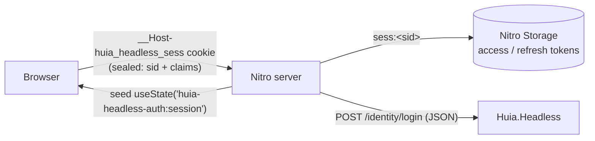

# `nuxt-huia-headless` — overview

`nuxt-huia-headless` is the first-party **Nuxt 4** module for apps that authenticate against a
`Huia.Headless` backend: a plain JSON register/login API, no OIDC redirect, no discovery document. Its
sibling module, [`nuxt-huia-oidc`](/nuxt/overview), covers the multi-tenant OIDC flow against
`Huia.OpenId` instead.

- Package: `nuxt-huia-headless` · config key `huiaHeadless`
- No `openid-client` dependency — talks to `Huia.Headless` with plain `fetch`
- Same dual-layer session principle as `nuxt-huia-oidc`: the browser only ever holds a sealed,
  chunked session cookie; access/refresh tokens live server-side in Nitro Storage and are refreshed
  transparently

## Why it's a separate module, not an option on `nuxt-huia-oidc`

The two backends are different enough in kind, not just configuration, that folding one into the
other would leak abstractions both ways:

| | `Huia.OpenId` (`nuxt-huia-oidc`) | `Huia.Headless` (`nuxt-huia-headless`) |
|---|---|---|
| Protocol | OAuth 2.0 Authorization Code + PKCE, redirect-based | Plain JSON POST/GET, no redirect |
| Login UI | Hosted on the identity server (Razor pages) | Owned by the app itself — there is nothing to redirect to |
| Tokens | JWTs (OpenIddict-signed), validable by a separate resource server | Opaque bearer tokens, valid only against the app that minted them |
| Sign-out | RP-initiated `end_session` round-trip | Purely local — delete the local token, nothing to tell the server |
| Multi-tenancy | Yes — `tenant` is part of the config | No — `Huia.Headless` is single-tenant only |

## Architecture at a glance



The cookie is `iron-webcrypto`-sealed, `HttpOnly`, `Secure`, `SameSite=Lax`, `__Host-` prefixed (bare
name over plain http in dev), and auto-chunked past the ~4 KB per-cookie browser limit — identical
mechanics to `nuxt-huia-oidc`.

## Server routes it adds

| Route | Purpose |
|---|---|
| `POST /auth/register` | proxies `Huia.Headless`'s register endpoint — does **not** sign in |
| `POST /auth/login` | login, then fetches `identity/me` and establishes the session |
| `POST /auth/logout` | clears the local session cookie + stored tokens — no server round-trip |
| `POST /auth/refresh` | manual refresh (usually unnecessary — `getUserSession` refreshes transparently) |
| `GET /auth/session` | the sanitised `{ user, loggedIn, expiresAt }` — never a token |
| `GET /auth/confirm-email`, `POST /auth/resend-confirmation`, `/auth/forgot-password`, `/auth/reset-password` | thin proxies to the matching `Huia.Headless` endpoints |
| `POST /auth/phone/start`, `/verify`, `/complete-profile` | passwordless SMS one-time-code login |
| `GET /auth/external/{provider}` | starts an external-login redirect (a link, not a `fetch` call — see below) |
| `POST /auth/external-exchange`, `/auth/external-complete-profile` | completes external login after the provider's callback |

All paths are configurable via `routes`. Unlike `nuxt-huia-oidc`'s `login`/`callback`/`logout`
(browser-navigated redirects), every route except the external-login challenge is a plain API call
the app's own login form invokes with `$fetch`/`useRequestFetch`.

## Composables & server utilities

- Client: `useUserSession()` (`user`, `loggedIn`, `session`, `hasRole()`, `hasAnyRole()`, `fetch()`,
  `clear()`) and `useHuia()` (`register()`, `login()`, `logout`, `startPhoneLogin()`,
  `verifyPhoneLogin()`, `completePhoneProfile()`, `externalLoginHref()`, `exchangeExternalCode()`,
  `completeExternalProfile()`).
- Server (auto-imported in `server/**`): `getUserSession(event)`, `setUserSession`,
  `clearUserSession`, `requireUserSession(event)` (401s), `getAccessToken(event)` (server-only —
  forward the bearer to `Huia.Headless` or an upstream API).

## External login

Because a real provider redirect has to physically leave the app's origin, `externalLoginHref`
returns a plain URL for an `<a>` tag, not something you `fetch`. The module's own `GET
/auth/external/{provider}` route builds the *absolute* `returnUrl` `Huia.Headless`'s
`AllowedReturnUrlPrefixes` allow-list expects — the app's own origin plus
`huiaHeadless.externalCallbackPage` (default `/auth/callback`) — from a caller-supplied same-origin
path, so the app never has to know its own deployed origin:

```vue
<a :href="useHuia().externalLoginHref('google', '/dashboard')">Sign in with Google</a>
```

The app owns the callback page itself (`huiaHeadless.externalCallbackPage` just names where it
lives — Huia.Headless has no hosted "completing sign-in…" page to redirect to). That page reads
`?code=` and `?returnTo=` off its own route, calls `exchangeExternalCode(code)` — which returns the
bearer session directly for a linked/existing account, or `{ requiresProfile: true, flowId }` for a
first-time sign-up — and, in the latter case, collects a name and calls
`completeExternalProfile({ code: flowId, firstName, lastName })`.

## Reference integration

`samples/Shop.Api` + `samples/Shop.App` puts this module through a full register → login → cart →
checkout → logout round trip, plus phone login and external login against a real upstream IdP
([`Huia.External`](https://github.com/Ayman-Elfaki/Huia/tree/main/samples/Huia.External), the same
mock provider `Todo.App` uses) — all covered end to end by
[`ShopE2ETests`](https://github.com/Ayman-Elfaki/Huia/tree/main/tests/Huia.E2ETests/ShopE2ETests.cs).
