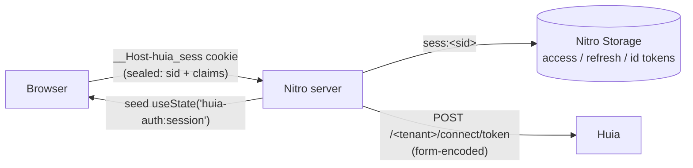

# `huia-nuxt` — overview

`huia-nuxt` is the first-party **Nuxt 4** module for signing a relying-party app into a Huia
tenant. It runs the OAuth 2.0 Authorization Code flow with PKCE (and RFC 9126 PAR) on the **Nitro
server**, and keeps every token server-side.

- Package: `huia-nuxt` · config key `huiaAuth`
- Built on [`openid-client`](https://github.com/panva/openid-client) v6 (ESM, Web Crypto)
- Full build-to spec: [`src/nuxt/SPEC.md`](https://github.com/Ayman-Elfaki/Huia/blob/main/src/nuxt/SPEC.md)

## Why not a generic OIDC module

- **Zero client-side token leakage.** Access, refresh and id tokens live only in Nitro Storage,
  keyed by an opaque session id. The browser holds a sealed cookie carrying the session id and a
  whitelisted subset of user claims — nothing else.
- **PAR by default.** The authorization parameters are pushed to Huia's `/{tenant}/connect/par`
  back channel; the browser only ever sees `client_id` + `request_uri`. Falls back to a signed
  front-channel request when the OP does not advertise a PAR endpoint.
- **Transparent refresh.** A near-expired access token is refreshed inside `getUserSession()` /
  `getAccessToken()`, guarded by an in-process single-flight map and a cross-worker soft lock so
  concurrent SSR requests never trigger duplicate `refresh_token` grants.
- **SSR-safe hydration** following the `nuxt-auth-utils` pattern — no flash of unauthenticated
  content, no hydration mismatch.

## Architecture at a glance

The cookie is `iron-webcrypto`-sealed, `HttpOnly`, `Secure`, `SameSite=Lax`, `__Host-` prefixed, and
**auto-chunked** across `__Host-huia_sess.0`, `.1`, … to bypass the ~4 KB per-cookie browser limit.

## Server routes it adds

| Route | Purpose |
|---|---|
| `GET /auth/oidc/login` | begin the flow (PKCE, state/nonce, PAR push) |
| `GET /auth/oidc/callback` | code exchange, create the session, redirect to `returnTo` |
| `GET /auth/oidc/logout` | clear the session + RP-initiated `end_session` |
| `GET /api/_auth/session` | the sanitised `{ user, loggedIn, expiresAt }` — never a token |

All four paths are configurable. The default `/auth/oidc/callback` matches Huia's historical redirect
URI so no client re-registration is needed.

## Composables & server utilities

- Client: `useUserSession()` (`user`, `loggedIn`, `session`, `expiresAt`, `fetch()`, `clear()`) and
  `useAuth()` (`login()`, `logout()`).
- Server (auto-imported in `server/**`): `getUserSession(event)`, `setUserSession`,
  `clearUserSession`, `requireUserSession(event)` (401s), `getAccessToken(event)` (server-only —
  forward the bearer to your upstream APIs).
